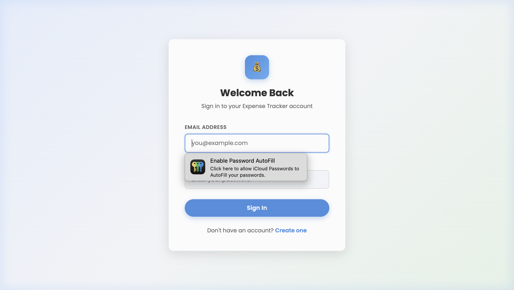
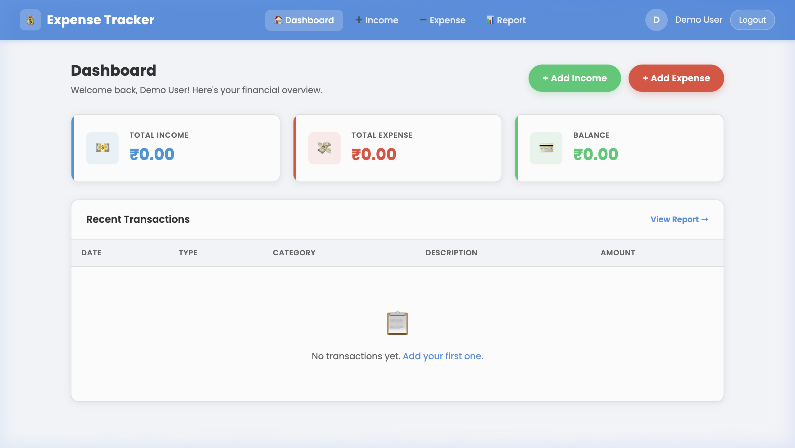
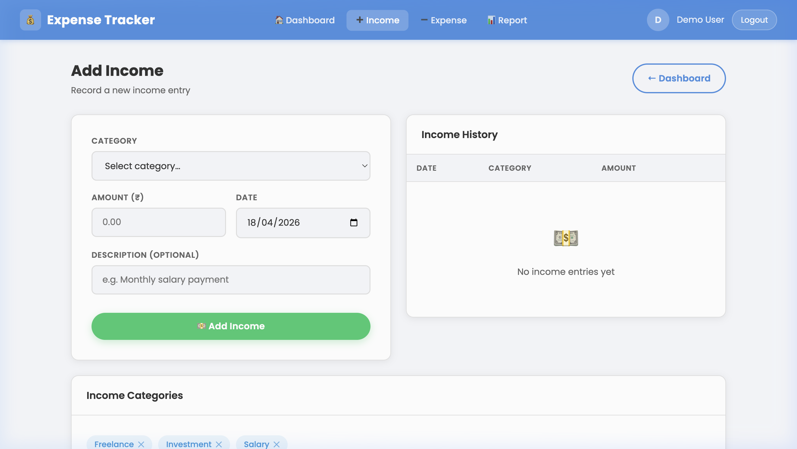
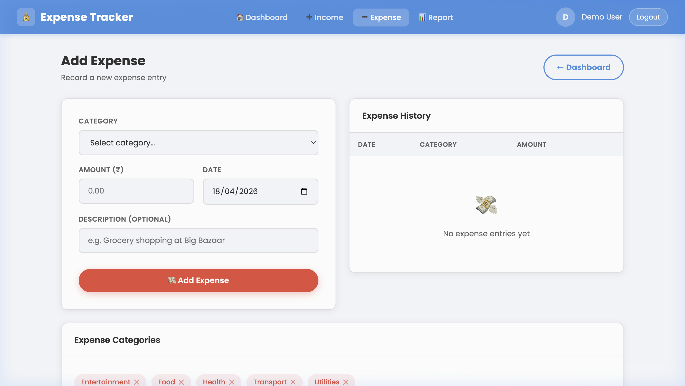
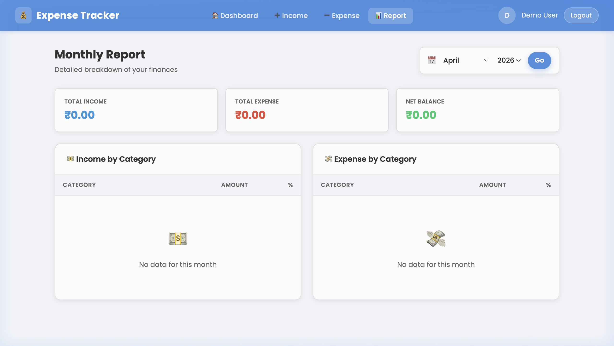
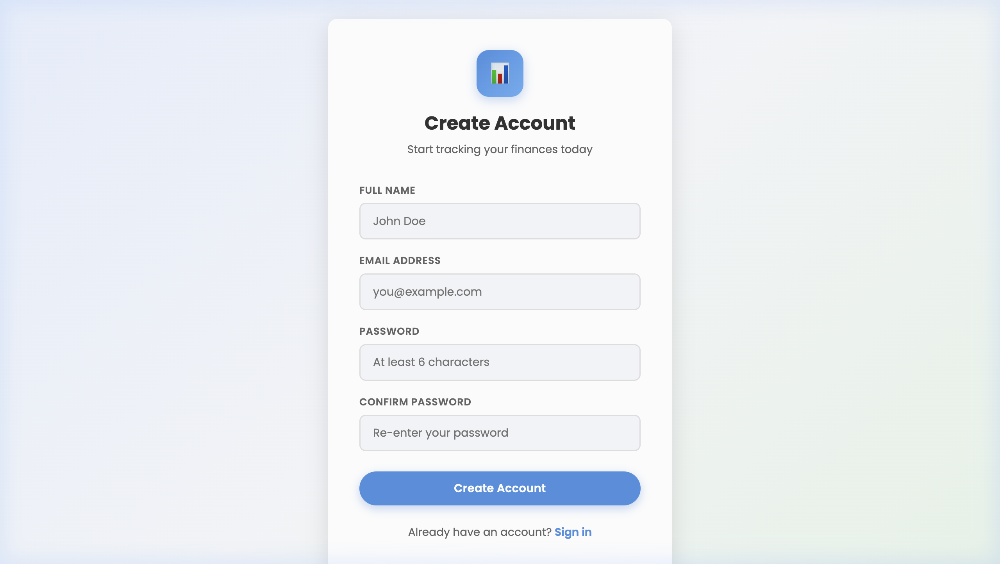

# 💰 Expense Tracker System

A full-stack personal finance management web application built as a **DBMS Mini Project**. Track your income, expenses, and spending patterns with an intuitive dashboard and reporting tools.

---

## 📸 Screenshots

### Login Page


### Dashboard


### Add Income


### Add Expense


### Reports


### Register


---

## 🚀 Features

- 🔐 **User Authentication** — Secure register & login with JWT (7-day expiry) and bcrypt password hashing
- 🏠 **Dashboard** — Real-time financial overview with Total Income, Total Expense, and Balance cards
- 💵 **Income Management** — Add, view, and filter income entries by category and date
- 💸 **Expense Management** — Add, view, and filter expense entries with category support
- 🏷️ **Category Management** — Custom income and expense categories; defaults are seeded on registration
- 📊 **Reports** — Filter transactions by date range and type; view summaries and breakdowns
- 🛡️ **Protected Routes** — All data endpoints are secured with JWT middleware
- 📱 **Responsive UI** — Clean, light-themed design that works across screen sizes

---

## 🛠️ Tech Stack

| Layer      | Technology                              |
|------------|-----------------------------------------|
| Frontend   | HTML5, Vanilla CSS, Vanilla JavaScript  |
| Backend    | Node.js, Express.js                     |
| Database   | MySQL                                   |
| Auth       | JSON Web Tokens (JWT), bcryptjs         |
| Dev Tools  | Nodemon, dotenv                         |

---

## 📁 Project Structure

```
Expense-Tracker-System/
├── backend/
│   ├── middleware/
│   │   └── authMiddleware.js   # JWT verification middleware
│   ├── routes/
│   │   ├── auth.js             # Register & Login
│   │   ├── income.js           # Income CRUD
│   │   ├── expense.js          # Expense CRUD
│   │   ├── category.js         # Category management
│   │   ├── dashboard.js        # Summary stats + recent transactions
│   │   └── report.js           # Filtered transaction reports
│   ├── db.js                   # MySQL connection pool
│   ├── constants.js            # App-wide constants (JWT secret)
│   ├── server.js               # Express app entry point
│   ├── .env                    # Environment variables (not committed)
│   └── package.json
├── frontend/
│   ├── css/
│   │   └── style.css           # Global stylesheet
│   ├── js/
│   │   ├── auth.js             # Login & register logic
│   │   ├── dashboard.js        # Dashboard data fetching
│   │   ├── income.js           # Income page logic
│   │   ├── expense.js          # Expense page logic
│   │   └── report.js           # Report page logic
│   ├── index.html              # Login page
│   ├── register.html           # Registration page
│   ├── dashboard.html          # Dashboard
│   ├── add-income.html         # Add income form
│   ├── add-expense.html        # Add expense form
│   └── report.html             # Reports page
├── database/
│   └── schema.sql              # MySQL database schema
└── screenshots/                # App screenshots for README
```

---

## 🗄️ Database Schema

The application uses a MySQL database (`expense_tracker`) with the following tables:

```sql
Users        — user_id, name, email, password (hashed), created_at
Category     — category_id, user_id (FK), name, type (income|expense), created_at
Income       — income_id, user_id (FK), category_id (FK), amount, description, date, created_at
Expense      — expense_id, user_id (FK), category_id (FK), amount, description, date, created_at
```

All foreign keys cascade on delete. Category is set to `NULL` on Income/Expense if the category is deleted.

---

## ⚙️ Setup & Installation

### Prerequisites

- [Node.js](https://nodejs.org/) v18+
- [MySQL](https://www.mysql.com/) v8+

### 1. Clone the Repository

```bash
git clone https://github.com/your-username/Expense-Tracker-System.git
cd Expense-Tracker-System
```

### 2. Set Up the Database

Open MySQL and run the schema:

```bash
mysql -u root -p < database/schema.sql
```

### 3. Configure Environment Variables

Create a `.env` file inside the `backend/` directory:

```env
DB_HOST=localhost
DB_USER=root
DB_PASSWORD=your_mysql_password
DB_NAME=expense_tracker
DB_PORT=3306
JWT_SECRET=your_super_secret_key
```

### 4. Install Backend Dependencies

```bash
cd backend
npm install
```

### 5. Start the Server

```bash
# Development (with auto-reload)
npm run dev

# Production
npm start
```

The server starts at **http://localhost:5001**.

### 6. Open the App

Open your browser and navigate to:
```
http://localhost:5001
```

The Express server serves the frontend static files automatically.

---

## 🔌 API Reference

All `/api/*` routes (except auth) require the `Authorization: Bearer <token>` header.

### Auth

| Method | Endpoint              | Description        |
|--------|-----------------------|--------------------|
| POST   | `/api/auth/register`  | Register a user    |
| POST   | `/api/auth/login`     | Login & get token  |

### Income

| Method | Endpoint         | Description             |
|--------|------------------|-------------------------|
| GET    | `/api/income`    | Get all income entries  |
| POST   | `/api/income`    | Add a new income entry  |
| DELETE | `/api/income/:id`| Delete an income entry  |

### Expense

| Method | Endpoint          | Description              |
|--------|-------------------|--------------------------|
| GET    | `/api/expense`    | Get all expense entries  |
| POST   | `/api/expense`    | Add a new expense entry  |
| DELETE | `/api/expense/:id`| Delete an expense entry  |

### Categories

| Method | Endpoint           | Description              |
|--------|--------------------|--------------------------|
| GET    | `/api/category`    | Get all user categories  |
| POST   | `/api/category`    | Create a new category    |
| DELETE | `/api/category/:id`| Delete a category        |

### Dashboard

| Method | Endpoint          | Description                                    |
|--------|-------------------|------------------------------------------------|
| GET    | `/api/dashboard`  | Returns totals (income, expense, balance) and recent transactions |

### Reports

| Method | Endpoint       | Description                                            |
|--------|----------------|--------------------------------------------------------|
| GET    | `/api/report`  | Filtered transactions (supports `?type=`, `?from=`, `?to=`) |

---

## 🔐 Authentication Flow

1. User registers → password is hashed with **bcrypt** (10 rounds)
2. On registration, **8 default categories** are seeded for the user
3. User logs in → receives a signed **JWT** (valid 7 days)
4. JWT is stored in `localStorage` and sent as `Authorization: Bearer <token>` on every request
5. Protected routes verify the token via `authMiddleware.js`

---

## 📄 License

This project is for educational purposes — DBMS Mini Project.

---

> Made with ❤️ using Node.js, Express, MySQL, and Vanilla JS
